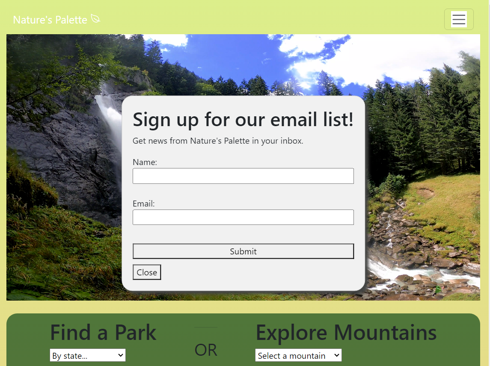

# Nature's Palette Project

Welcome to the Nature's Palette project! This web application provides information about mountains and national parks, allowing users to explore and learn more about these natural wonders.

## Table of Contents

1. [Overview](#overview)
2. [HTML Files](#html-files)
    - [Homepage (index.html)](#homepage-indexhtml)
    - [Mountains Information (info.html)](#mountains-information-infohtml)
    - [Parks Information (parks.html)](#parks-information-parkshtml)

## Overview

Nature's Palette is a web application that provides users with information about mountains and national parks. The project includes multiple HTML files, each catering to a specific section of the application.

## HTML Files

### Homepage (index.html)

The homepage serves as the main entry point for users. It features a navigation bar, a popup form, a video container, a dropdown for park locations, a dropdown for exploring mountains, a results section, an image carousel, and a footer with social media icons.

### Mountains Information (info.html)

This page focuses on presenting information about mountains. It includes a navigation bar, a dropdown for selecting mountains, and a results section that dynamically updates based on the selected mountain. Additionally, it utilizes the Sunrise and Sunset API to fetch sunrise and sunset times for the selected mountain.

### Parks Information (parks.html)

The parks information page is dedicated to showcasing national parks. It includes a navigation bar, dropdowns for selecting a location and park type, a results section that filters and displays national parks based on the user's selection, and a footer with social media icons.

